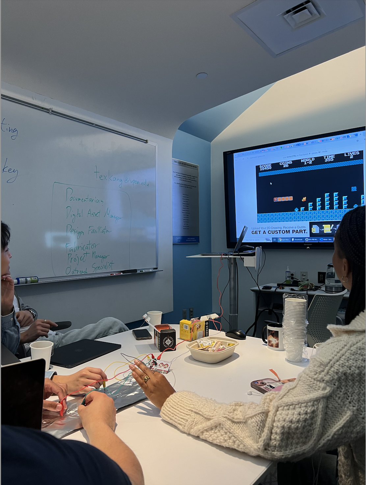
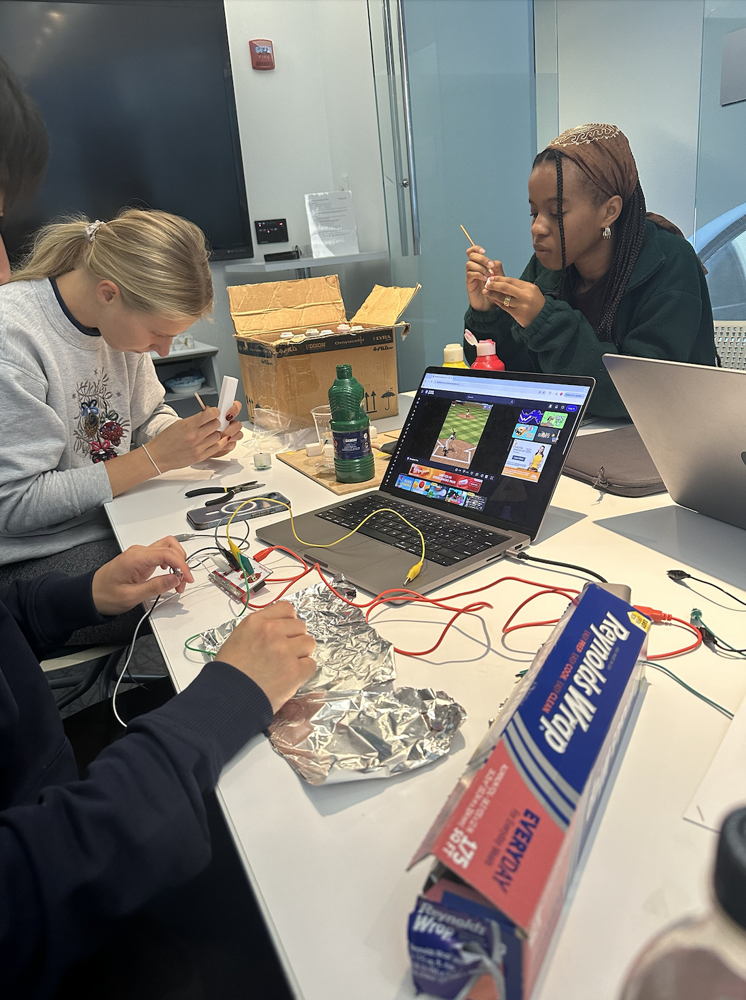

# ImaniNkrumahArdayfio.github.io

**Reflection for Critical Making Assignment**

For the Critical Making Project, I was assigned to the Interactivity group and tasked with creating something engaging and interactive to represent or share the data from The Umpire. The goal was to create something that appealed visually and kinesthetically to our intended audience (the class). We also wanted to evoke a connection between the audience and the lived experiences of the inmates.

During our first meeting at Education Commons, we were introduced to three technologies and resources that could be used to display our data. The first was the 3D printer, the second was the Makey Makey, and the third was the NFC. Afterward, we had to decide which dataset we wanted to use. It seemed that a consensus was quickly reached to focus our project on baseball. I am not particularly interested in or knowledgeable about the sport, but the four boys in my group seemed excited about it, so I agreed. Looking back, we could have spent more time discussing the importance of baseball to the members of Eastern State Penitentiary before diving into the process of critically making something. Nevertheless, we all agreed that it would be a fun challenge to try and use each of the technologies we were shown and engage the class in several different ways.

For our dataset, we used a record of six teams and their wins and losses for the 1913 season. To visualize this data, we decided to 3D-print a bar graph comparing each team’s wins. Using Tinkercad, we created and scaled the graph, ensuring to write a team name underneath their corresponding bars. This task was completed during our first meeting so we would have time to collect the print during the second meeting. For the NFC component, we wanted the bar graph to link to the original dataset as well as to additional datasets for other games played between the six teams. To achieve this, we created an Excel spreadsheet that could be accessed by holding a phone to the NFC sticker on the graph. For the Makey Makey, we decided to use an existing baseball video game for interaction, as we did not have time to design our own game.

Our group worked very well together. Everyone was encouraging and complimentary and listened attentively to each other. We divided up tasks with ease and communicated effectively. I volunteered to be the outreach coordinator, responsible for creating and facilitating our slide presentation. Having attended all our team sessions, I synthesized our meetings and processes into cohesive and engaging slides for the class.

One aspect that initially left me unsatisfied was my lack of understanding of baseball’s relevance to Eastern State Penitentiary inmates. To address this, I worked with a group member who had written a multimedia essay on baseball, integrating this essential context into our presentation. Additionally, I created a 2D model of the bar graph, included screenshots of the Excel table, and painted and color-coded the numbers on the 3D model to enhance its visual appeal.

One of the most successful parts of our presentation was the Makey Makey game. Initially, I was unsure how engaging it would be, especially since I had to hold up the computer screen while two volunteers played. However, seeing the joy on the participants' faces and the engagement from the rest of the class was heartwarming. Surprisingly, the technical limitation of being unable to display the game on a larger screen worked in our favor. The intimate setup of people crowding around a small screen fostered a sense of unity and togetherness. This moment, in particular, felt reflective of the camaraderie that inmates might have experienced while playing baseball.

Although the game was engaging, I regret not leaving enough time to give a proper demo of the bar graph and the NFC component. While the bar graph was passed around during the presentation, some participants might have missed the NFC sticker and could not access the larger data collection we had prepared. Additionally, while the project achieved its technical goals, it fell short in emphasizing the humanizing aspects of the data. One of the key points of this project was to view the inmates as individuals beyond their identities as prisoners. I’m not sure we succeeded in doing this. When comparing the groups that focused on holidays or religion,  their projects seemed to reflect the individual identities of the inmates more. When I think about what I learned about the inmates or the prison, I come to the conclusion that I engaged more critically with the idea of baseball as a sport than its place in Eastern State. If I had the chance to do this project again, I would focus more on the humanizing aspect of the data and discuss it before embarking on our project. Despite these shortcomings, the project was valuable in revealing the various ways to engage with a dataset.
